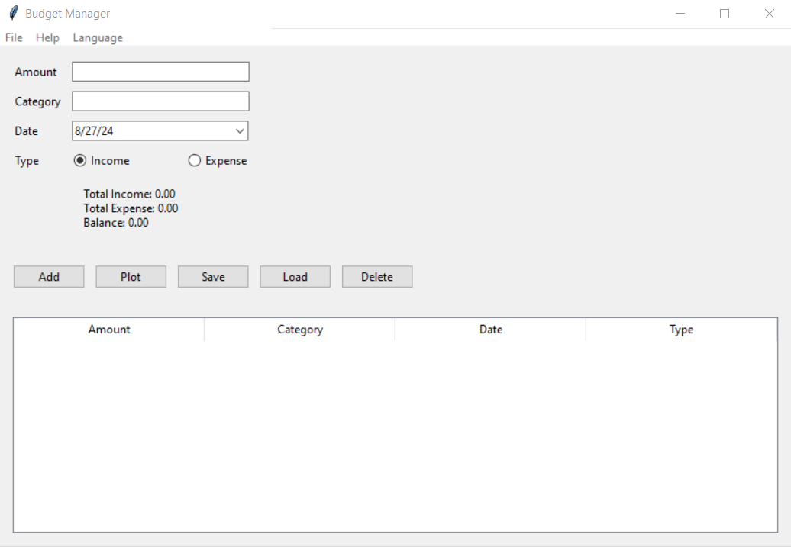

# BudgetFidger

BudgetFidger is a user-friendly budget management tool designed to help you efficiently track your income and expenses. It offers visual summaries of your financial situation and supports multiple languages, including Finnish and English.



## Features

- Track Income and Expenses: Easily log your financial transactions and categorize them.
- Visual Summaries: View clear and concise summaries of your financial status.
- Multi-language Support: Available in Finnish and English to accommodate diverse users.
- User-Friendly Interface: Simple and intuitive design for easy navigation.

## Installation

To install and run BudgetFidger, follow these steps:

Clone the Repository:

1. Clone Repository: Clone the repository to your local machine:

```bash
git clone https://github.com/micsno/BudgetFidgerApp.git
 ```

2. Navigate to the Project Directory:

 ```bash
cd BudgetFidger
```

3. Install Dependencies: Make sure you have Python 3 installed. Install matplotlib if not already installed:

```bash
pip install -r requirements.txt
```

4. Run the Application:

```bash
python BudgetFidger.py
```

## Usage
- Add Entries: Use the application to input your income and expenses.
- View Summary: Access the summary to see your total income, expenses, and balance.
- Switch Languages: Choose between Finnish and English from the language menu.

## Contributing
Contributions are welcome! Please fork the repository and submit a pull request with your changes. For bug reports and feature requests, open an issue on the GitHub repository.

## License
This project is licensed under the MIT License. See the LICENSE file for details.

## Contact
For questions or feedback, please contact [micsno@pm.me](micsno@pm.me).